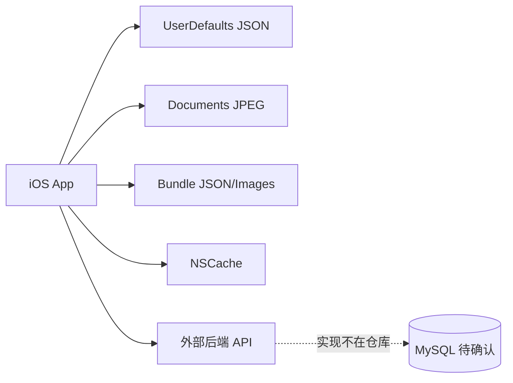
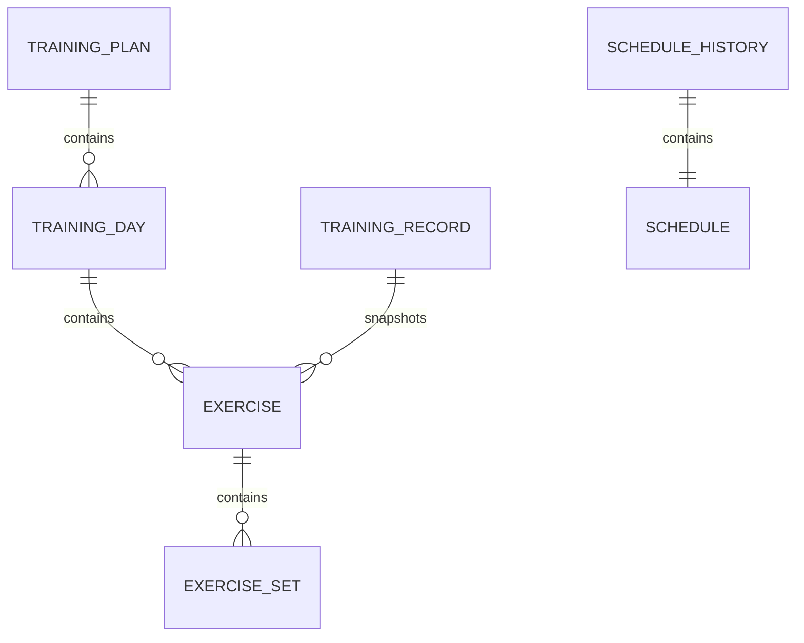
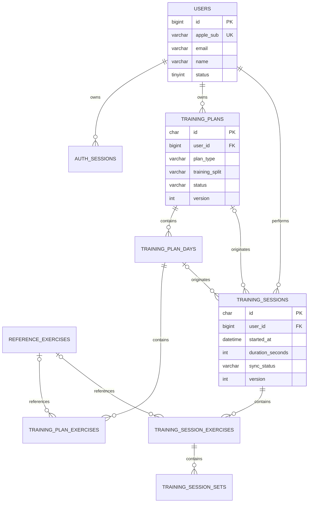
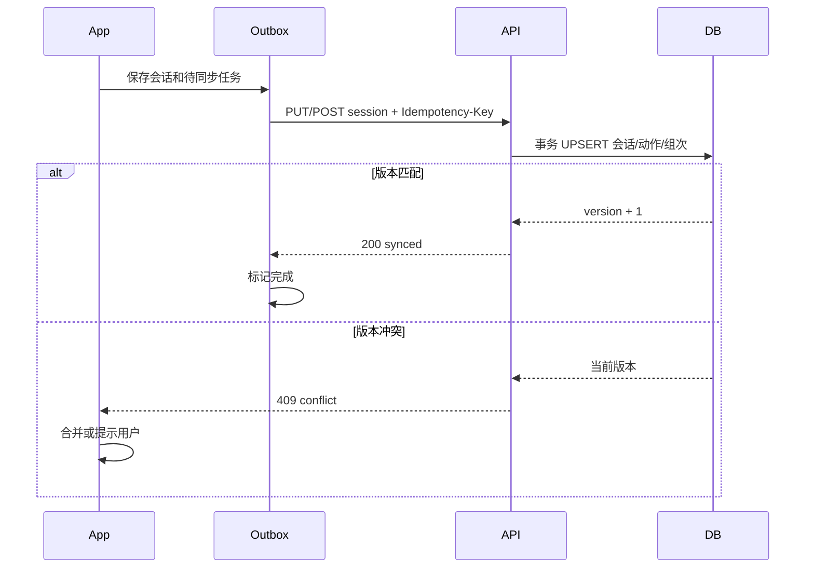

# SmartFitness 数据库设计文档（DBD）

> 文档版本：V1.0  
> 更新日期：2026-07-14  
> 事实边界：当前仓库是 iOS 客户端，不包含 MySQL DDL、Migration、ORM 或后端源码。第 2 章为当前真实本地存储；第 3 章起为依据客户端模型和 API 反推的 MySQL V1 建议方案，实施前必须由后端确认。

## 1. 数据架构概述

### 1.1 当前实际架构



当前客户端没有 Core Data、SwiftData、SQLite 或 Realm。训练计划和记录以嵌套 JSON 保存至 UserDefaults，动作/饮料数据为只读 Bundle 资源。

### 1.2 数据域

| 数据域 | 当前来源 | 建议主存储 |
|---|---|---|
| 用户与会话 | Apple 登录响应、UserDefaults | MySQL + Redis/Token 服务；端侧 Keychain |
| 训练计划 | AI 响应/手动创建、UserDefaults | MySQL |
| 训练会话 | UserDefaults + 远程 API | MySQL |
| 动作参考库 | Bundle JSON | Bundle 为主；需要动态更新时进入 MySQL |
| 饮料参考库 | Bundle JSON | 实验功能，暂保留 Bundle |
| 行程历史 | UserDefaults + Documents | 实验功能；可选 MySQL + OSS |

## 2. 客户端本地存储（已实现）

### 2.1 UserDefaults

| Key | 类型 | 内容 | 删除条件 |
|---|---|---|---|
| `saved_user_data` | `User` JSON | 用户资料与 Token | 401 或登出 |
| `saved_training_plan` | `TrainingPlan` JSON | AI 计划 | 切换手动计划、重置 |
| `saved_manual_plan` | `TrainingPlan` JSON | 手动计划 | 切换 AI 计划、重置 |
| `saved_training_records` | `[TrainingRecord]` JSON | 全部本地训练记录 | 当前无自动删除 |
| `schedule_history_records` | `[ScheduleHistoryRecord]` JSON | 实验行程元数据 | 用户删除 |

### 2.2 文件与只读资源

| 路径 | 内容 | 生命周期 |
|---|---|---|
| `Documents/ScheduleImages/{uuid}.jpg` | 行程截图 | 删除行程时删除 |
| `dist/exercises.json` | 873 条聚合动作 | 随 App 版本 |
| `exercises/` | 单动作 JSON 与图片 | 随 App 版本 |
| `Views/drinks.json` | 约 200 条饮料数据 | 随 App 版本 |

### 2.3 当前本地模型关系



这些关系均为 JSON 嵌套，不存在物理外键或数据库索引。

## 3. MySQL V1 逻辑模型（建议）

### 3.1 设计原则

1. MySQL 8.0，默认字符集 `utf8mb4`，时区统一存 UTC。
2. 业务记录使用客户端生成的 `CHAR(36)` UUID，支持离线创建与幂等同步。
3. 用户内部主键使用 `BIGINT UNSIGNED`，Apple `sub` 设唯一索引。
4. 训练计划与训练会话分离；会话保存动作快照，不依赖参考库后续变更。
5. 多值查询字段使用关联表；只用于展示的快照可使用 JSON。
6. 所有业务表包含 `created_at`、`updated_at`；需要软删除的表包含 `deleted_at`。
7. 不在用户表存储可直接使用的明文长期 Token。

### 3.2 ER 图



## 4. 表结构

### 4.1 `users`

| 字段 | 类型 | Null | 默认值 | 约束/说明 |
|---|---|---:|---|---|
| `id` | BIGINT UNSIGNED | 否 | AUTO_INCREMENT | PK |
| `apple_sub` | VARCHAR(128) | 否 | — | Apple 唯一用户标识，UK |
| `email` | VARCHAR(254) | 是 | NULL | 邮箱 |
| `name` | VARCHAR(100) | 是 | NULL | 显示名 |
| `status` | TINYINT UNSIGNED | 否 | 1 | 1 active，2 disabled，3 deleted |
| `last_login_at` | DATETIME(3) | 是 | NULL | 最近登录时间 |
| `created_at` | DATETIME(3) | 否 | CURRENT_TIMESTAMP(3) | 创建时间 |
| `updated_at` | DATETIME(3) | 否 | CURRENT_TIMESTAMP(3) | 更新时间 |
| `deleted_at` | DATETIME(3) | 是 | NULL | 软删除 |

索引：

- `PRIMARY KEY (id)`
- `UNIQUE KEY uk_users_apple_sub (apple_sub)`
- `KEY idx_users_email (email)`
- `KEY idx_users_status_updated (status, updated_at)`

### 4.2 `auth_sessions`

| 字段 | 类型 | Null | 说明 |
|---|---|---:|---|
| `id` | CHAR(36) | 否 | PK |
| `user_id` | BIGINT UNSIGNED | 否 | FK → users.id |
| `refresh_token_hash` | CHAR(64) | 否 | 仅存哈希 |
| `device_id_hash` | CHAR(64) | 是 | 设备匿名哈希 |
| `expires_at` | DATETIME(3) | 否 | Refresh 过期 |
| `revoked_at` | DATETIME(3) | 是 | 吊销时间 |
| `created_at` | DATETIME(3) | 否 | 创建时间 |
| `last_used_at` | DATETIME(3) | 是 | 最近使用 |

索引：

- `PRIMARY KEY (id)`
- `KEY idx_auth_sessions_user (user_id, revoked_at)`
- `KEY idx_auth_sessions_expire (expires_at)`
- FK `user_id`，`ON DELETE CASCADE`

Access Token 建议使用短期 JWT 或不透明 Token；明文 Token 不落库。

### 4.3 `training_plans`

| 字段 | 类型 | Null | 默认值 | 说明 |
|---|---|---:|---|---|
| `id` | CHAR(36) | 否 | — | 客户端 UUID，PK |
| `user_id` | BIGINT UNSIGNED | 否 | — | FK |
| `plan_type` | VARCHAR(16) | 否 | — | `ai`/`manual` |
| `training_split` | VARCHAR(100) | 否 | '' | 计划名称 |
| `instructions` | TEXT | 是 | NULL | 说明 |
| `status` | VARCHAR(16) | 否 | `active` | active/archived/deleted |
| `source_request_id` | CHAR(36) | 是 | NULL | AI 生成请求 ID |
| `version` | INT UNSIGNED | 否 | 1 | 乐观锁 |
| `client_created_at` | DATETIME(3) | 否 | — | 客户端创建时间 |
| `created_at` | DATETIME(3) | 否 | CURRENT_TIMESTAMP(3) | 服务端创建 |
| `updated_at` | DATETIME(3) | 否 | CURRENT_TIMESTAMP(3) | 服务端更新 |
| `deleted_at` | DATETIME(3) | 是 | NULL | 软删除 |

索引：

- `PRIMARY KEY (id)`
- `KEY idx_plans_user_status (user_id, status, updated_at)`
- `UNIQUE KEY uk_plans_source_request (user_id, source_request_id)`
- FK `user_id`，`ON DELETE CASCADE`

业务约束：同一用户只能有一个 active 计划。MySQL 无条件唯一索引，可通过事务锁、生成列唯一索引或独立 `user_active_plan` 映射表保证。

### 4.4 `training_plan_days`

| 字段 | 类型 | Null | 说明 |
|---|---|---:|---|
| `id` | CHAR(36) | 否 | PK |
| `plan_id` | CHAR(36) | 否 | FK |
| `day_order` | SMALLINT UNSIGNED | 否 | 计划内顺序 |
| `weekday` | TINYINT UNSIGNED | 是 | 1=周日…7=周六 |
| `label` | VARCHAR(100) | 否 | 展示标签 |
| `day_kind` | VARCHAR(16) | 否 | training/rest/recovery |
| `focus` | VARCHAR(100) | 是 | 训练部位 |
| `created_at` | DATETIME(3) | 否 | 创建时间 |
| `updated_at` | DATETIME(3) | 否 | 更新时间 |

索引：

- `PRIMARY KEY (id)`
- `UNIQUE KEY uk_plan_days_order (plan_id, day_order)`
- `KEY idx_plan_days_weekday (plan_id, weekday)`
- FK `plan_id`，`ON DELETE CASCADE`

### 4.5 `training_plan_exercises`

| 字段 | 类型 | Null | 说明 |
|---|---|---:|---|
| `id` | CHAR(36) | 否 | 动作实例 PK |
| `plan_day_id` | CHAR(36) | 否 | FK |
| `reference_exercise_id` | VARCHAR(100) | 是 | FK，可空 |
| `exercise_order` | SMALLINT UNSIGNED | 否 | 顺序 |
| `exercise_name` | VARCHAR(200) | 否 | 名称快照 |
| `target_sets` | SMALLINT UNSIGNED | 否 | 目标组数 |
| `target_reps` | VARCHAR(32) | 否 | 目标次数/范围 |
| `equipment` | VARCHAR(100) | 是 | 器械快照 |
| `difficulty` | VARCHAR(32) | 是 | 难度快照 |
| `focus_area` | VARCHAR(100) | 是 | 部位快照 |
| `primary_muscles` | JSON | 是 | 肌群快照 |
| `images` | JSON | 是 | 图片引用快照 |
| `instructions` | TEXT | 是 | 说明快照 |
| `rest_seconds` | SMALLINT UNSIGNED | 否 | 默认 90 |
| `created_at` | DATETIME(3) | 否 | 创建时间 |
| `updated_at` | DATETIME(3) | 否 | 更新时间 |

索引：

- `PRIMARY KEY (id)`
- `UNIQUE KEY uk_plan_exercise_order (plan_day_id, exercise_order)`
- `KEY idx_plan_exercise_reference (reference_exercise_id)`
- FK `plan_day_id`，`ON DELETE CASCADE`
- FK `reference_exercise_id`，`ON DELETE SET NULL`

### 4.6 `training_sessions`

| 字段 | 类型 | Null | 默认值 | 说明 |
|---|---|---:|---|---|
| `id` | CHAR(36) | 否 | — | 客户端 TrainingRecord UUID，PK |
| `user_id` | BIGINT UNSIGNED | 否 | — | FK |
| `plan_id` | CHAR(36) | 是 | NULL | 来源计划 |
| `plan_day_id` | CHAR(36) | 是 | NULL | 来源计划日 |
| `started_at` | DATETIME(3) | 否 | — | UTC |
| `local_date` | DATE | 否 | — | 用户本地日期 |
| `timezone` | VARCHAR(64) | 否 | `UTC` | IANA 时区 |
| `focus_area` | VARCHAR(200) | 是 | NULL | 部位 |
| `duration_seconds` | INT UNSIGNED | 否 | 0 | 时长 |
| `is_completed` | TINYINT(1) | 否 | 0 | 是否完成 |
| `total_volume` | DECIMAL(14,2) | 否 | 0 | 可重建汇总 |
| `version` | INT UNSIGNED | 否 | 1 | 乐观锁 |
| `client_updated_at` | DATETIME(3) | 否 | — | 冲突判断 |
| `created_at` | DATETIME(3) | 否 | CURRENT_TIMESTAMP(3) | 创建 |
| `updated_at` | DATETIME(3) | 否 | CURRENT_TIMESTAMP(3) | 更新 |
| `deleted_at` | DATETIME(3) | 是 | NULL | 软删除 |

索引：

- `PRIMARY KEY (id)`
- `KEY idx_sessions_user_date (user_id, local_date, started_at)`
- `KEY idx_sessions_user_updated (user_id, updated_at)`
- `KEY idx_sessions_plan (plan_id, plan_day_id)`
- FK `user_id`，`ON DELETE CASCADE`
- FK `plan_id`，`ON DELETE SET NULL`
- FK `plan_day_id`，`ON DELETE SET NULL`

不建议对 `(user_id, local_date)` 设置唯一索引，因为用户可能同日多次训练。当前客户端会按日合并，后端应保留原始会话，并在查询层按产品需要聚合。

### 4.7 `training_session_exercises`

| 字段 | 类型 | Null | 说明 |
|---|---|---:|---|
| `id` | CHAR(36) | 否 | 客户端动作实例 PK |
| `session_id` | CHAR(36) | 否 | FK |
| `reference_exercise_id` | VARCHAR(100) | 是 | 参考动作 FK |
| `exercise_order` | SMALLINT UNSIGNED | 否 | 顺序 |
| `exercise_name` | VARCHAR(200) | 否 | 名称快照 |
| `target_sets` | SMALLINT UNSIGNED | 否 | 目标组数 |
| `target_reps` | VARCHAR(32) | 否 | 目标次数 |
| `equipment` | VARCHAR(100) | 是 | 器械 |
| `difficulty` | VARCHAR(32) | 是 | 难度 |
| `focus_area` | VARCHAR(100) | 是 | 部位 |
| `primary_muscles` | JSON | 是 | 肌群 |
| `images` | JSON | 是 | 图片 |
| `instructions` | TEXT | 是 | 说明 |
| `rest_seconds` | SMALLINT UNSIGNED | 否 | 休息秒数 |
| `created_at` | DATETIME(3) | 否 | 创建 |
| `updated_at` | DATETIME(3) | 否 | 更新 |

索引：

- `PRIMARY KEY (id)`
- `UNIQUE KEY uk_session_exercise_order (session_id, exercise_order)`
- `KEY idx_session_exercise_reference (reference_exercise_id)`
- FK `session_id`，`ON DELETE CASCADE`
- FK `reference_exercise_id`，`ON DELETE SET NULL`

### 4.8 `training_session_sets`

| 字段 | 类型 | Null | 默认值 | 说明 |
|---|---|---:|---|---|
| `id` | CHAR(36) | 否 | — | 客户端 ExerciseSet UUID，PK |
| `session_exercise_id` | CHAR(36) | 否 | — | FK |
| `set_order` | SMALLINT UNSIGNED | 否 | — | 组序号 |
| `weight_kg` | DECIMAL(8,2) | 否 | 0 | 重量 |
| `reps` | SMALLINT UNSIGNED | 否 | 0 | 实际次数 |
| `is_completed` | TINYINT(1) | 否 | 0 | 是否完成 |
| `completed_at` | DATETIME(3) | 是 | NULL | 完成时间 |
| `created_at` | DATETIME(3) | 否 | CURRENT_TIMESTAMP(3) | 创建 |
| `updated_at` | DATETIME(3) | 否 | CURRENT_TIMESTAMP(3) | 更新 |

索引：

- `PRIMARY KEY (id)`
- `UNIQUE KEY uk_session_set_order (session_exercise_id, set_order)`
- `KEY idx_sets_completed (session_exercise_id, is_completed)`
- FK `session_exercise_id`，`ON DELETE CASCADE`

约束：`weight_kg >= 0`、`reps >= 0`。MySQL 8.0.16+ 可使用 CHECK，服务层仍需校验。

### 4.9 `reference_exercises`

该表仅在动作库需要服务端动态更新、搜索或统一 ID 时启用；否则 Bundle JSON 是当前事实来源。

| 字段 | 类型 | Null | 说明 |
|---|---|---:|---|
| `id` | VARCHAR(100) | 否 | Bundle 动作 ID，PK |
| `name_en` | VARCHAR(200) | 否 | 英文名 |
| `name_zh` | VARCHAR(200) | 是 | 中文名 |
| `force_type` | VARCHAR(16) | 是 | pull/push/static |
| `level` | VARCHAR(16) | 否 | beginner/intermediate/expert |
| `mechanic` | VARCHAR(16) | 是 | compound/isolation |
| `equipment` | VARCHAR(100) | 是 | 器械 |
| `category` | VARCHAR(32) | 否 | 类别 |
| `primary_muscles` | JSON | 否 | 主肌群 |
| `secondary_muscles` | JSON | 否 | 次肌群 |
| `instructions` | JSON | 否 | 步骤数组 |
| `images` | JSON | 否 | 图片引用 |
| `data_version` | INT UNSIGNED | 否 | 数据版本 |
| `is_active` | TINYINT(1) | 否 | 是否可用 |
| `created_at` | DATETIME(3) | 否 | 创建 |
| `updated_at` | DATETIME(3) | 否 | 更新 |

索引：

- `PRIMARY KEY (id)`
- `KEY idx_ref_exercise_category (category, level, is_active)`
- `KEY idx_ref_exercise_equipment (equipment, is_active)`
- `FULLTEXT KEY ft_ref_exercise_name (name_en, name_zh)`

### 4.10 `sync_outbox`（端侧或服务端可选）

服务端通常不需要存客户端 Outbox，但若接收异步处理任务，可使用：

| 字段 | 类型 | 说明 |
|---|---|---|
| `id` | BIGINT UNSIGNED | PK |
| `user_id` | BIGINT UNSIGNED | 用户 |
| `aggregate_type` | VARCHAR(32) | `training_session` 等 |
| `aggregate_id` | CHAR(36) | 业务 ID |
| `event_type` | VARCHAR(64) | 事件类型 |
| `payload` | JSON | 事件内容 |
| `status` | VARCHAR(16) | pending/processing/done/failed |
| `retry_count` | SMALLINT UNSIGNED | 重试次数 |
| `next_retry_at` | DATETIME(3) | 下次重试 |
| `created_at` | DATETIME(3) | 创建 |
| `processed_at` | DATETIME(3) | 完成 |

索引：`idx_outbox_dispatch(status, next_retry_at, id)`。

## 5. DDL 示例

以下展示核心训练表的建议 DDL；所有表应由 Migration 工具管理，不应在生产手工执行。

```sql
CREATE TABLE users (
    id BIGINT UNSIGNED NOT NULL AUTO_INCREMENT,
    apple_sub VARCHAR(128) NOT NULL,
    email VARCHAR(254) NULL,
    name VARCHAR(100) NULL,
    status TINYINT UNSIGNED NOT NULL DEFAULT 1,
    last_login_at DATETIME(3) NULL,
    created_at DATETIME(3) NOT NULL DEFAULT CURRENT_TIMESTAMP(3),
    updated_at DATETIME(3) NOT NULL DEFAULT CURRENT_TIMESTAMP(3)
        ON UPDATE CURRENT_TIMESTAMP(3),
    deleted_at DATETIME(3) NULL,
    PRIMARY KEY (id),
    UNIQUE KEY uk_users_apple_sub (apple_sub),
    KEY idx_users_email (email),
    KEY idx_users_status_updated (status, updated_at)
) ENGINE=InnoDB DEFAULT CHARSET=utf8mb4 COLLATE=utf8mb4_0900_ai_ci;
```

```sql
CREATE TABLE training_sessions (
    id CHAR(36) NOT NULL,
    user_id BIGINT UNSIGNED NOT NULL,
    plan_id CHAR(36) NULL,
    plan_day_id CHAR(36) NULL,
    started_at DATETIME(3) NOT NULL,
    local_date DATE NOT NULL,
    timezone VARCHAR(64) NOT NULL DEFAULT 'UTC',
    focus_area VARCHAR(200) NULL,
    duration_seconds INT UNSIGNED NOT NULL DEFAULT 0,
    is_completed TINYINT(1) NOT NULL DEFAULT 0,
    total_volume DECIMAL(14,2) NOT NULL DEFAULT 0,
    version INT UNSIGNED NOT NULL DEFAULT 1,
    client_updated_at DATETIME(3) NOT NULL,
    created_at DATETIME(3) NOT NULL DEFAULT CURRENT_TIMESTAMP(3),
    updated_at DATETIME(3) NOT NULL DEFAULT CURRENT_TIMESTAMP(3)
        ON UPDATE CURRENT_TIMESTAMP(3),
    deleted_at DATETIME(3) NULL,
    PRIMARY KEY (id),
    KEY idx_sessions_user_date (user_id, local_date, started_at),
    KEY idx_sessions_user_updated (user_id, updated_at),
    CONSTRAINT fk_sessions_user FOREIGN KEY (user_id)
        REFERENCES users(id) ON DELETE CASCADE
) ENGINE=InnoDB DEFAULT CHARSET=utf8mb4 COLLATE=utf8mb4_0900_ai_ci;
```

```sql
CREATE TABLE training_session_exercises (
    id CHAR(36) NOT NULL,
    session_id CHAR(36) NOT NULL,
    reference_exercise_id VARCHAR(100) NULL,
    exercise_order SMALLINT UNSIGNED NOT NULL,
    exercise_name VARCHAR(200) NOT NULL,
    target_sets SMALLINT UNSIGNED NOT NULL,
    target_reps VARCHAR(32) NOT NULL,
    equipment VARCHAR(100) NULL,
    difficulty VARCHAR(32) NULL,
    focus_area VARCHAR(100) NULL,
    primary_muscles JSON NULL,
    images JSON NULL,
    instructions TEXT NULL,
    rest_seconds SMALLINT UNSIGNED NOT NULL DEFAULT 90,
    created_at DATETIME(3) NOT NULL DEFAULT CURRENT_TIMESTAMP(3),
    updated_at DATETIME(3) NOT NULL DEFAULT CURRENT_TIMESTAMP(3)
        ON UPDATE CURRENT_TIMESTAMP(3),
    PRIMARY KEY (id),
    UNIQUE KEY uk_session_exercise_order (session_id, exercise_order),
    CONSTRAINT fk_session_exercises_session FOREIGN KEY (session_id)
        REFERENCES training_sessions(id) ON DELETE CASCADE
) ENGINE=InnoDB DEFAULT CHARSET=utf8mb4 COLLATE=utf8mb4_0900_ai_ci;
```

```sql
CREATE TABLE training_session_sets (
    id CHAR(36) NOT NULL,
    session_exercise_id CHAR(36) NOT NULL,
    set_order SMALLINT UNSIGNED NOT NULL,
    weight_kg DECIMAL(8,2) NOT NULL DEFAULT 0,
    reps SMALLINT UNSIGNED NOT NULL DEFAULT 0,
    is_completed TINYINT(1) NOT NULL DEFAULT 0,
    completed_at DATETIME(3) NULL,
    created_at DATETIME(3) NOT NULL DEFAULT CURRENT_TIMESTAMP(3),
    updated_at DATETIME(3) NOT NULL DEFAULT CURRENT_TIMESTAMP(3)
        ON UPDATE CURRENT_TIMESTAMP(3),
    PRIMARY KEY (id),
    UNIQUE KEY uk_session_set_order (session_exercise_id, set_order),
    KEY idx_sets_completed (session_exercise_id, is_completed),
    CONSTRAINT fk_sets_session_exercise FOREIGN KEY (session_exercise_id)
        REFERENCES training_session_exercises(id) ON DELETE CASCADE,
    CONSTRAINT chk_sets_weight CHECK (weight_kg >= 0),
    CONSTRAINT chk_sets_reps CHECK (reps >= 0)
) ENGINE=InnoDB DEFAULT CHARSET=utf8mb4 COLLATE=utf8mb4_0900_ai_ci;
```

## 6. 字典与状态枚举

### 6.1 业务枚举

| 枚举 | 值 | 存储建议 |
|---|---|---|
| 训练水平 | novice/intermediate/advanced | VARCHAR + 应用校验 |
| 每周频次 | three/four/five/six | API 可兼容；库内建议 TINYINT 3–6 |
| 场景 | gym/home/outdoor | VARCHAR |
| 伤病 | shoulder/waist/knee/wrist/elbow/none | 关联表或 JSON |
| 训练日类型 | training/rest/recovery | VARCHAR |
| 计划类型 | ai/manual | VARCHAR |
| 计划状态 | active/archived/deleted | VARCHAR |
| 用户状态 | active/disabled/deleted | TINYINT 字典 |
| 同步状态 | pending/syncing/synced/failed | 端侧枚举；服务端按需 |

不建议使用 MySQL 原生 ENUM：添加值需要 DDL，跨服务兼容较差。应在代码、OpenAPI 与字典文档中共同约束。

### 6.2 动作库字典

| 字段 | 已知值 |
|---|---|
| `level` | beginner/intermediate/expert |
| `force_type` | pull/push/static |
| `mechanic` | compound/isolation |
| `category` | cardio、olympic weightlifting、plyometrics、powerlifting、strength、stretching、strongman |

肌群和器械值来自数据集，导入前应做标准化映射并保留原始值。

## 7. 数据同步规则

### 7.1 当前规则（已实现）

1. 训练结束先写 UserDefaults。
2. 随后调用 `/api/training/save`。
3. 同步失败时本地记录保留，进行中页面允许手动重试。
4. 历史页本地有所选日期记录时不请求远程。
5. 本地无记录时按日期请求远程并写回本地。
6. 本地同日记录按日期合并并累加时长。
7. AI/手动计划当前不上传服务端。

### 7.2 目标规则

| 项 | 规则 |
|---|---|
| 主键 | 客户端 UUID，全链路不变 |
| 幂等 | 相同 UUID 的重复保存不创建重复记录 |
| 时间 | 服务端存 UTC；同时保存客户端 `local_date` 和 IANA 时区 |
| 冲突 | 使用 `version` + `client_updated_at`；版本冲突返回 409 |
| 删除 | 软删除并记录版本；同步到其他设备 |
| 重试 | 指数退避：1m、5m、30m、2h、12h，网络恢复时提前触发 |
| 合并 | 服务端保留多会话；按日汇总由查询层生成 |
| 完整性 | 会话、动作、组次在单事务中 UPSERT |

### 7.3 同步时序



## 8. 缓存设计

### 8.1 客户端缓存

| 数据 | 当前 | 目标过期 |
|---|---|---|
| 动作图片 | NSCache，无上限/TTL | 内存压力驱逐；配置成本上限 |
| 动作库 | App 生命周期内存 | 随资源版本失效 |
| 训练历史 | UserDefaults 永久 | 用户删除或同步覆盖 |
| 网络响应 | URLSession 默认 | 根据 ETag/Cache-Control |

### 8.2 服务端缓存（建议）

| Key | 内容 | TTL | 失效 |
|---|---|---:|---|
| `user:{id}:active_plan` | 当前活动计划 ID/摘要 | 15 min | 计划写入/归档 |
| `user:{id}:training:{date}` | 当日训练聚合 | 5 min | 会话写入/删除 |
| `exercise:data_version` | 动作库版本 | 24 h | 发布新版本 |
| `exercise:detail:{id}` | 动作详情 | 24 h | 动作更新 |
| `auth:session:{id}` | 会话状态 | 不超过 Token 有效期 | 登出/吊销 |
| `rate:plan:{user}:{window}` | AI 生成限流 | 窗口期 | 自动过期 |

要求：

- 使用 Cache-Aside；MySQL 是事实源。
- 先提交数据库事务，再删除相关缓存。
- 用户缓存 Key 必须包含 user ID，禁止跨用户复用训练数据。
- Redis 故障时核心读写应降级至数据库，不丢训练记录。

## 9. 数据过期与保留

| 数据 | 建议保留 | 说明 |
|---|---|---|
| 用户主记录 | 账号存续期 | 注销后按隐私政策匿名化/删除 |
| Access Token | 15–60 min | 不落明文库 |
| Refresh Session | 30–90 天 | 可撤销；过期清理 |
| 训练计划 | 长期或用户删除后 30 天 | 软删除后异步物理清理 |
| 训练会话/组次 | 账号存续期 | 用户核心数据 |
| AI 原始 Prompt/Response | 默认不长期保留；最长 30 天调试 | 需脱敏和用户告知 |
| API 日志 | 7–30 天 | 不记录敏感凭证 |
| 审计日志 | 180 天或合规要求 | 仅必要操作 |
| Outbox 已完成事件 | 7 天 | 定期清理 |
| 失败事件 | 30 天 | 告警后归档/清理 |
| 软删除数据 | 30 天 | 随后物理删除 |

实际保留期需结合隐私政策、适用法规和业务恢复需求确认。

## 10. 分库分表

### 10.1 V1 结论

当前数据规模和单用户访问模式不需要分库分表。过早分片会增加事务、外键、查询和运维复杂度。V1 使用单 MySQL 主库 + 备库即可，按索引和归档优化。

### 10.2 扩展触发条件

满足以下任一条件再评估：

- `training_sessions` 达到数亿行且索引/归档后仍无法满足 P95。
- 单库写入持续超过容量安全线。
- 备份恢复时间超过业务 RTO。
- 明确的数据驻留或租户隔离要求。

### 10.3 未来分片策略

- 按 `user_id` 一致性哈希分片，确保单用户数据同库。
- 会话子表通过冗余 `user_id` 路由，避免跨库查找。
- 参考动作库保持全局独立库或静态分发，不跟随用户分片。
- 聚合分析进入数据仓库，不在在线分片库做跨库全表统计。

## 11. 备份、恢复与数据安全

### 11.1 建议目标

- MySQL 开启自动备份与 Binlog。
- 每日全量备份 + 持续增量，跨可用区保存。
- RPO ≤ 5 分钟，RTO ≤ 2 小时（上线前由业务确认）。
- 每季度执行恢复演练。
- 生产账号最小权限，应用账号禁止 DDL。
- 备份加密，传输使用 TLS。
- 邮箱、Apple `sub` 等个人数据限制访问并记录审计。

### 11.2 删除流程

账号注销应：

1. 撤销所有会话。
2. 禁止继续写入。
3. 在宽限期内软删除。
4. 到期物理删除用户、计划、会话和组次。
5. 删除关联 OSS 对象与缓存。
6. 对必须保留的审计数据做不可逆匿名化。

## 12. Migration 规范

当前仓库没有 Migration。后端应选用与框架匹配的工具（Flyway、Liquibase、Alembic 等）。

要求：

1. Migration 文件只追加、不修改已发布版本。
2. 使用“扩展—迁移—收缩”处理破坏性变更。
3. 大表新增索引使用在线 DDL 并预估锁表影响。
4. 每次发布记录 schema version。
5. 变更同时更新 DBD、OpenAPI、回滚和数据修复方案。
6. DDL 在 Staging 使用生产量级副本验证后再上线。

## 13. 待确认事项

1. 外部后端是否实际使用 MySQL，以及当前真实表结构。
2. `/api/training/save` 的幂等、覆盖和事务规则。
3. 同日多次训练是保留多会话还是服务端聚合为一条。
4. `RemoteTrainingLog` 遗留模型是否对应现有表。
5. AI 计划是否需要云端持久化和跨设备同步。
6. Token 类型、会话表和过期策略。
7. 动作库是否继续 Bundle 分发，还是改为服务端动态更新。
8. 训练数据、AI 输入和账号注销的正式保留政策。

