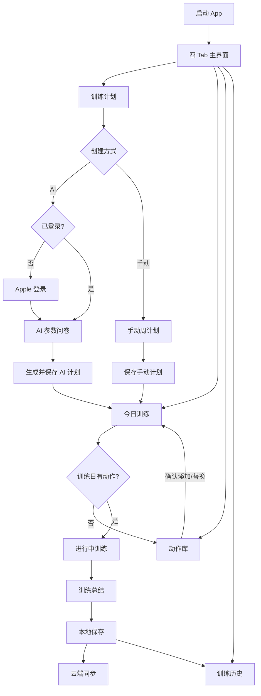
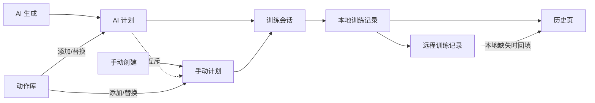

# SmartFitness 产品需求文档（PRD）

> 文档版本：V1.0  
> 更新日期：2026-07-14  
> 适用范围：当前 `SmartFitness` iOS 客户端  
> 事实边界：`已实现` 来自当前代码；`规划` 为基于现状补齐的产品要求；`待确认` 需产品或后端负责人确认。

## 1. 产品概述

### 1.1 产品定义

SmartFitness 是一款面向个人健身用户的 iOS 训练管理应用，以“制定计划—执行训练—记录组次—复盘历史”为核心闭环。用户可以通过 AI 生成训练计划，也可以手动配置每周训练，并从本地动作库添加或替换动作。

当前产品视觉定位为 Kinetic Noir：深色背景、荧光黄绿主色、橙红警示色，品牌标题以英文大写 HUD 风格呈现，功能说明以中文为主。

### 1.2 产品目标

1. 降低用户制定训练计划的门槛。
2. 在训练过程中提供清晰的组次、重量、次数和休息引导。
3. 通过周计划达成率和历史记录帮助用户持续训练。
4. 在弱网或未登录状态下保留核心本地训练能力。

### 1.3 非目标

当前版本不包含以下正式能力：

- 教练端、管理员端、团队或家庭账号。
- 社区、好友、排行榜和内容发布。
- 订阅、支付和商城。
- Android、Web 或 Apple Watch 客户端。
- 已注释实验功能的正式上线：食物识别、饮料 OCR、行程识别、本地 LLM。

### 1.4 目标用户

| 用户类型 | 核心诉求 | 对应能力 |
|---|---|---|
| 健身新手 | 不知道如何排计划和选择动作 | AI 计划、默认组次、动作图示 |
| 进阶训练者 | 自定义周计划并追踪训练量 | 手动计划、重量/次数记录、历史复盘 |
| 临时训练用户 | 当天快速选择动作开始训练 | 动作库、自选训练 |
| 未登录用户 | 不创建账号也能完成基础训练 | 本地计划、本地记录 |

### 1.5 成功指标（规划）

| 指标 | 定义 |
|---|---|
| 计划创建转化率 | 打开计划创建页后成功生成或保存计划的用户占比 |
| 首训转化率 | 创建计划后 24 小时内开始训练的用户占比 |
| 训练完成率 | 已开始训练中生成完成记录的占比 |
| 周计划达成率 | 已完成计划训练日数 / 当周计划训练日数 |
| 7 日留存 | 首次使用后第 7 天再次打开应用的用户占比 |
| 同步成功率 | 远程训练同步成功次数 / 同步请求次数 |

## 2. 信息架构与功能模块

### 2.1 主导航

应用包含四个 Tab：

1. `TRAINING PLAN`：计划创建、当前计划和周进度。
2. `TODAY TRAINING`：选择训练日并执行训练。
3. `LIBRARY`：搜索、筛选、添加或替换动作。
4. `HISTORY`：查看日历、周达成和训练详情。

### 2.2 功能模块

| 模块 | 功能 | 状态 |
|---|---|---|
| 训练计划中心 | 展示 AI/手动计划、周进度、每日安排 | 已实现 |
| AI 计划生成 | 收集水平、频次、场景、伤病并请求后端生成 | 已实现 |
| 手动周计划 | 配置 7 天训练/休息/恢复、部位和动作 | 已实现 |
| 今日训练 | 切换训练日、查看动作、开始或继续训练 | 已实现 |
| 训练执行 | 记录重量/次数/完成组、休息计时、替换动作 | 已实现 |
| 动作库 | 本地动作搜索、分类、多选、插入、替换 | 已实现 |
| 训练历史 | 月历、本周达成、每日训练详情 | 已实现 |
| Apple 登录 | AI 生成前登录，后端换取业务 Token | 已实现 |
| 云端同步 | 保存训练记录、按日期回填历史 | 已实现 |
| 产品埋点 | 用户行为与漏斗分析 | 未实现，本文给出需求 |
| 推送、支付、地图、OSS | 无正式需求与实现 | 不在当前范围 |

## 3. 页面与流程

### 3.1 页面流程图

### 3.2 计划与动作数据流

### 3.3 核心业务规则

1. AI 计划和手动计划互斥；保存其中一种会清除另一种。
2. 未登录用户可以浏览动作、创建手动计划、训练和保存本地记录。
3. AI 计划生成前必须完成 Apple 登录。
4. 动作库支持普通多选、指定训练日插入、单动作替换三种模式。
5. 训练结束先保存本地记录，再尝试远程同步。
6. 历史页优先读取本地记录，仅在本地没有所选日期记录时请求远程。
7. 同一天的本地训练记录按日期合并，训练时长累加。

## 4. 页面详细需求

### 4.1 训练计划中心

| 项目 | 说明 |
|---|---|
| 页面输入 | 当前用户、AI 计划、手动计划、训练记录 |
| 页面输出 | 欢迎语、当前计划、周达成、每日安排、今日动作预览 |
| 主按钮 | `AI GEN`、`MANUAL`、开始训练、为空训练日添加动作 |
| 弹窗/跳转 | AI 生成 Sheet、手动周计划 Sheet、进行中训练页 |
| 空状态 | `NO ACTIVE TRAINING PLAN`；提示生成 AI 计划或手动选择 |
| 加载状态 | 当前页无全局加载；登录和 AI 生成由子流程负责 |
| 异常处理 | 登录失败当前仅写日志；规划为展示“登录失败，请重试” |

交互逻辑：

- 点击 `AI GEN`：已登录则打开 AI 问卷；未登录先发起 Apple 登录。
- 点击 `MANUAL`：打开手动周计划。
- 当前计划有可训练动作时允许进入训练；空训练日引导前往动作库。
- 计划展示优先级为 AI 计划、今日手动计划、手动周计划。

### 4.2 AI 计划生成

| 项目 | 说明 |
|---|---|
| 页面输入 | 训练水平、每周频次、训练场景、伤病部位 |
| 页面输出 | 后端生成的周训练计划 |
| 主按钮 | 参数选项、`GENERATE PROTOCOL`、关闭 |
| 选择规则 | 水平/频次/场景单选；伤病多选；“无”与其他伤病互斥 |
| 加载状态 | 禁用重复提交，显示 `OPTIMIZING...` 和进度指示 |
| 成功状态 | 写入 AI 计划并关闭页面 |
| 失败状态 | 页内红色 `SYSTEM ERROR`；保留输入供重试 |
| 会话过期 | 收到 401 后清除用户和计划，返回未登录状态 |

### 4.3 手动周计划

| 项目 | 说明 |
|---|---|
| 页面输入 | 每周 7 天的类型、训练部位和动作 |
| 页面输出 | 手动训练计划 |
| 日类型 | 训练、休息、恢复 |
| 主按钮 | 取消、添加/管理动作、清空当天动作、创建/保存 |
| 空状态 | “还没有添加动作” |
| 跳转逻辑 | 添加动作时暂存目标日期，关闭 Sheet 并切换至动作库 |
| 保存逻辑 | 保存后设为唯一活动计划，并进入今日训练 Tab |

异常规则：

- 训练日无动作时允许保存，但今日训练页必须提示添加动作。
- 休息/恢复日不显示开始训练按钮。
- 清空动作必须二次确认，避免误删。

### 4.4 今日训练

| 项目 | 说明 |
|---|---|
| 页面输入 | 活动计划、所选日期、训练记录 |
| 页面输出 | 当日类型、动作列表、完成进度、漏练提醒 |
| 主交互 | 点击周日历或左右滑动切日 |
| 主按钮 | 开始/继续训练、添加动作、删除动作、清空当前日、查看记录 |
| 弹窗 | 清空当前训练日确认、删除动作确认 |
| 空状态 | `NO TRAINING TODAY`，引导创建 AI 计划或添加动作 |
| 休息状态 | 显示休息/恢复说明和下一训练日 |
| 完成状态 | 显示“本日训练已完成，查看记录” |

### 4.5 进行中训练

| 项目 | 说明 |
|---|---|
| 页面输入 | 当日动作、每组重量、次数、完成状态 |
| 页面输出 | 训练时长、动作进度、组进度、休息倒计时、总结 |
| 组操作 | 重量 ±2.5 kg、次数 ±1、直接输入重量、完成/取消完成 |
| 动作操作 | 上一个、下一个、增减组、替换、删除 |
| 主按钮 | 返回、结束训练 |
| 弹窗 | 输入重量、删除动作、退出训练、结束训练、训练完成 |
| 空状态 | `NO EXERCISES`，引导前往动作库 |
| 休息状态 | 完成组后显示休息倒计时，可跳过 |
| 保存状态 | 未生成、本地已保存、同步中、已同步、同步失败 |
| 异常处理 | 同步失败保留本地记录并提供重试 |

退出规则：

- “继续训练”：关闭确认框并保留当前状态。
- “放弃改动”：退出且不保存本次变更。
- “保存并退出”：生成本地记录，再尝试云同步。
- “结束训练”：进入总结页，由用户确认保存结果。

### 4.6 动作库

| 项目 | 说明 |
|---|---|
| 页面输入 | 本地动作 JSON、搜索词、分类、当前选择、插入/替换目标 |
| 页面输出 | 动作分组列表、动作图片、名称、器械、肌群 |
| 主交互 | 多关键词搜索、分类筛选、动作多选 |
| 主按钮 | 取消全选、确认选择、确认替换 |
| 加载状态 | 全屏进度指示 |
| 空状态 | `NO EXERCISES FOUND` |
| 普通模式 | 可多选并加入今日训练 |
| 指定日模式 | 多选后加入指定计划和日期 |
| 替换模式 | 仅允许选择一个动作并替换目标动作 |

默认转换规则：从动作库添加的动作默认 3 组、每组 12 次、休息 90 秒，用户可在训练页修改。

### 4.7 训练历史

| 项目 | 说明 |
|---|---|
| 页面输入 | 本地训练记录、所选日期、远程按日记录 |
| 页面输出 | 月历、本周达成、训练时长、训练容量、动作与组次 |
| 主交互 | 前后切月、选择日期、展开动作详情 |
| 加载状态 | `FETCHING RECORDS...` |
| 空状态 | `NO RECORD FOUND`；当日无记录时显示引导 |
| 异常处理 | 当前远程失败仅写日志；规划为显示可重试错误态 |

### 4.8 Apple 登录

| 项目 | 说明 |
|---|---|
| 触发条件 | 未登录用户点击 AI 计划生成 |
| 输入 | Apple Identity Token、Authorization Code、用户姓名 |
| 输出 | 业务用户和 Bearer Token |
| 取消 | 保持未登录，不打开 AI 问卷 |
| 失败 | 规划提示“登录失败，请重试” |
| 过期 | 401 清除本地用户与计划；规划提示重新登录 |

### 4.9 非主流程页面

`TrainingPlanDetailView` 与进行中训练能力重叠，当前无正式入口，应标记为遗留页面并在后续版本删除或合并。

食物热量识别、饮料糖 OCR、行程 OCR、日历写入和本地 LLM 页面均未接入主导航，只能作为实验功能管理，不纳入 V1 验收。

## 5. 状态与异常规范

### 5.1 通用页面状态

每个异步页面必须覆盖：

1. `initial`：尚未请求。
2. `loading`：显示加载反馈并防止重复提交。
3. `success`：展示内容。
4. `empty`：说明没有数据并提供下一步操作。
5. `error`：说明失败原因并提供重试。
6. `offline`：保留本地能力，明确云端同步延迟。

### 5.2 通用异常处理

| 场景 | 用户提示 | 处理 |
|---|---|---|
| 无网络 | 网络不可用，本次内容已保存在本机 | 保留本地数据，允许重试 |
| 请求超时 | 请求超时，请稍后重试 | 停止加载，保留输入 |
| 401 | 登录已过期，请重新登录 | 清 Token，跳转登录 |
| 服务器错误 | 服务暂时不可用，请稍后重试 | 展示重试按钮 |
| 数据解析失败 | 数据格式异常，请更新应用或重试 | 记录错误，不覆盖本地数据 |
| 本地资源缺失 | 动作资源加载失败 | 提供重试或降级文本列表 |
| 权限拒绝 | 需在系统设置中开启相关权限 | 提供“前往设置” |

## 6. 角色与权限

### 6.1 业务角色

当前只有两种会话状态，不存在 RBAC：

| 能力 | 游客 | 登录用户 |
|---|---:|---:|
| 浏览动作库 | 是 | 是 |
| 创建手动计划 | 是 | 是 |
| 本地训练与历史 | 是 | 是 |
| AI 生成计划 | 否 | 是 |
| 云端保存/拉取 | 后端行为待确认 | 是 |

### 6.2 系统权限

| 权限 | 当前用途 | 主流程状态 |
|---|---|---|
| Sign in with Apple | 用户认证 | 已启用 |
| 相机 | 食物/饮料实验功能 | 未接入 |
| HealthKit | 写入饮食热量 | 未接入 |
| 日历 | 写入识别出的行程 | 未接入 |

权限申请原则：仅在用户触发对应功能时请求；拒绝后解释用途，不阻断无关功能。

## 7. 埋点需求

当前代码未接入分析 SDK。规划事件如下：

| 事件名 | 触发时机 | 核心属性 |
|---|---|---|
| `app_open` | App 进入前台 | login_state, app_version |
| `tab_view` | 切换 Tab | tab_name, source_tab |
| `login_start/success/fail` | Apple 登录流程 | error_code |
| `plan_create_start` | 点击 AI 或手动创建 | plan_type |
| `plan_generate_success/fail` | AI 生成返回 | level, frequency, scene, injuries, latency_ms, error_code |
| `manual_plan_save` | 保存手动计划 | training_days, exercise_count |
| `exercise_search` | 提交/停止搜索 | keyword_length, result_count |
| `exercise_add` | 确认添加 | target, count, muscle_group |
| `exercise_replace` | 确认替换 | source_exercise_id, target_exercise_id |
| `workout_start` | 进入训练执行 | plan_type, exercise_count |
| `set_complete` | 完成一组 | exercise_id, set_index, weight, reps |
| `workout_abandon` | 放弃训练 | duration_sec, completed_sets |
| `workout_complete` | 保存训练结果 | duration_sec, completed_sets, total_volume |
| `sync_success/fail` | 云同步结束 | endpoint, latency_ms, error_code |
| `history_view_date` | 查看某日记录 | has_record, source_local_or_remote |

埋点要求：

- 不上传 Apple Identity Token、Bearer Token、姓名、邮箱和自由文本。
- 用户 ID 使用后端匿名标识；游客使用可重置设备级匿名 ID。
- 事件失败不得影响核心训练流程。

## 8. 文案规范

### 8.1 语言策略

- 功能说明、错误和确认操作以简体中文为主。
- 品牌栏目名可保留英文大写。
- 禁止同一操作在不同页面使用多个中文译法。
- 所有用户可见文案进入 `Localizable.xcstrings`，不得硬编码新增文案。

### 8.2 按钮规范

| 类型 | 推荐文案 |
|---|---|
| 主操作 | 开始训练、继续训练、保存计划、确认添加 |
| 次操作 | 取消、稍后、返回 |
| 危险操作 | 删除动作、清空训练日、放弃改动 |
| 重试 | 重新加载、重试同步、重新登录 |

危险操作必须使用明确对象名称，不使用模糊的“确定”。

### 8.3 空状态

空状态包含三部分：发生了什么、为什么、下一步操作。例如：

- 暂无训练计划。创建 AI 计划或手动安排本周训练。
- 今天没有训练动作。前往动作库添加动作。
- 这一天没有训练记录。完成一次训练后会显示在这里。

### 8.4 加载与报错

- 加载超过 300 ms 才显示指示器，避免闪烁。
- 超过 10 秒显示“仍在处理中”；AI 生成可使用更长等待提示。
- 错误文案不得直接暴露服务端堆栈、URL、Token 或内部错误对象。

## 9. 第三方依赖需求

| 依赖 | 用途 | 数据 | 当前状态 | 产品要求 |
|---|---|---|---|---|
| 自建后端 | 登录、AI 计划、训练同步 | 用户、计划参数、训练记录 | 主流程使用 | 必须提供 HTTPS、可用性和隐私说明 |
| Sign in with Apple | 身份认证 | Apple 授权凭证 | 主流程使用 | 支持取消、失败和过期重登 |
| 本地动作数据集 | 动作搜索和图示 | 873 条动作及图片 | 主流程使用 | 随 App 版本发布，资源缺失可降级 |
| DashScope/Qwen | 行程文本结构化 | OCR 文本 | 实验功能 | 上线前必须改为后端代理并移除客户端密钥 |
| OpenFoodFacts | 食物热量查询 | 食物名称 | 实验功能 | 明确数据准确性免责声明 |
| Vision/CoreML | OCR、食物识别 | 本地图片 | 实验功能 | 优先端侧处理并说明失败场景 |
| HealthKit | 写入饮食热量 | 健康数据 | 实验功能 | 单独授权，遵守 HealthKit 政策 |
| EventKit | 写入系统日历 | 行程信息 | 实验功能 | 写入前必须二次确认 |
| 支付、推送、地图、OSS | 暂无 | — | 未接入 | 引入时另立需求与隐私评审 |

## 10. 验收标准

1. 游客可完整完成“手动创建计划—添加动作—训练—查看本地历史”。
2. 登录用户可生成 AI 计划，失败时可见错误并可重试。
3. AI 与手动计划切换后只存在一个活动计划。
4. 完成训练后即使云同步失败，本地历史仍可查看且可重试同步。
5. 动作库在普通、指定日期和替换模式下均写入正确目标。
6. 所有删除、清空、放弃操作均有明确确认。
7. 四个主 Tab 均覆盖内容、空、加载和异常状态。
8. 主流程不依赖实验功能或未配置的第三方密钥。

## 11. 待确认事项

1. 产品主语言是否统一为中文，英文仅保留品牌标题。
2. 未登录用户调用训练同步接口时，服务端是否接受匿名数据。
3. 是否保留同一天多次训练合并逻辑，还是展示多条会话。
4. AI 计划是否需要云端保存和跨设备同步。
5. 遗留训练详情页和实验功能的下线或产品化时间。
6. V1 是否增加训练提醒推送与 HealthKit 训练写入。

