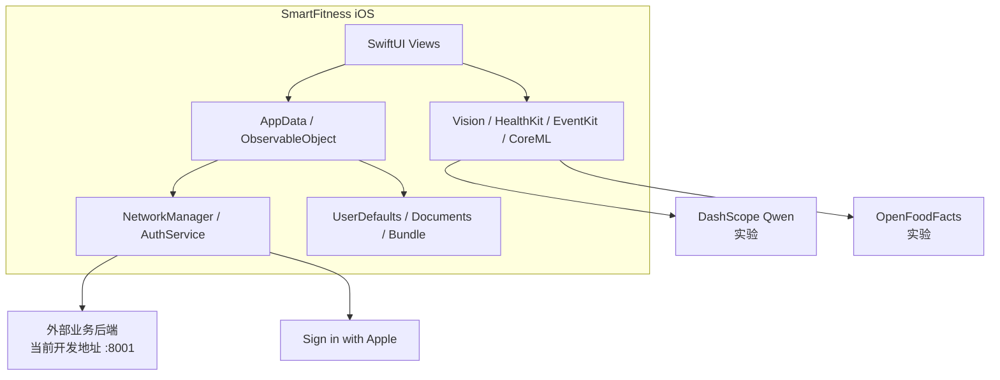
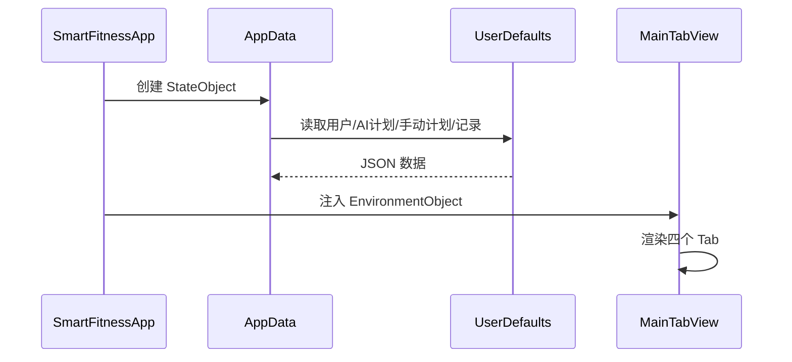
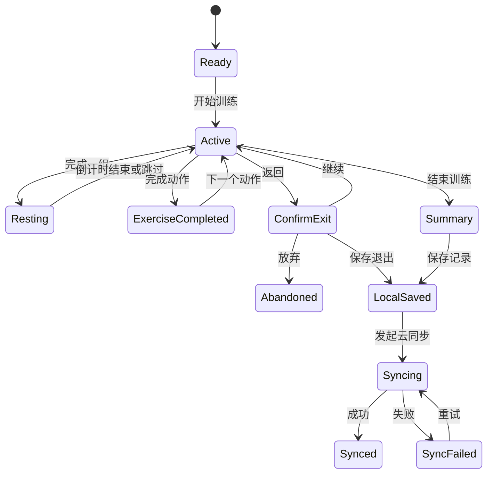
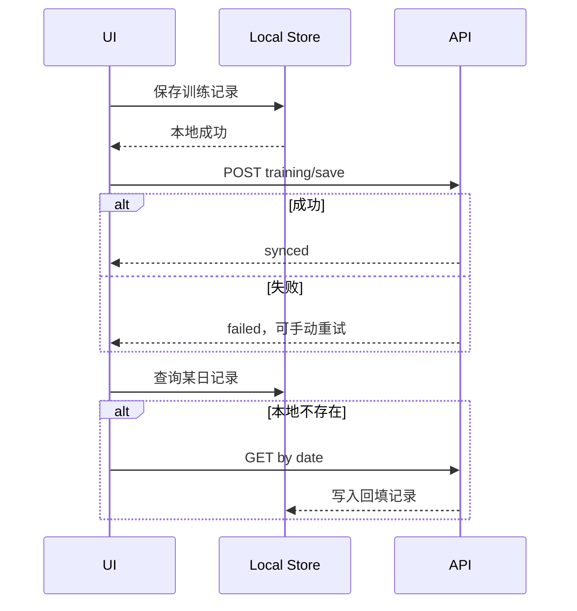
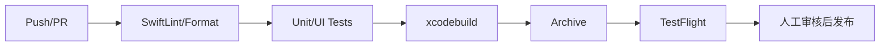

# SmartFitness 技术设计文档（TSD）

> 文档版本：V1.0  
> 更新日期：2026-07-14  
> 适用范围：当前仓库中的 iOS 客户端  
> 说明：仓库不包含后端代码、部署脚本或真实数据库 DDL。后端内容均依据客户端契约描述，并标记待确认项。

## 1. 系统概述

SmartFitness 是一套客户端—服务端分离的个人健身应用。当前仓库仅包含 SwiftUI iOS 客户端，负责界面、训练状态、本地持久化、动作资源和系统能力；外部后端负责 Apple 登录换取业务 Token、AI 训练计划生成和训练记录云端存取。

### 1.1 系统上下文



### 1.2 技术目标

- 核心训练流程离线可用，本地保存优先。
- UI 状态与业务状态保持单向可追踪。
- 远程 API 失败不丢失训练数据。
- 正式环境使用 HTTPS、安全凭证存储和环境隔离。
- 核心页面在主流 iPhone 上保持流畅。

## 2. 仓库与模块

```text
SmartFitness/
├── SmartFitnessApp.swift          # 应用入口和 AppData 注入
├── ContentView.swift              # 根视图
├── Common/
│   ├── NetworkManager.swift       # REST 网络层
│   ├── ExerciseImageView.swift    # 动作图片解析与内存缓存
│   └── StitchStyles.swift         # 主题与通用样式
├── Models/
│   ├── Models.swift               # 核心领域模型和 AppData
│   ├── LibraryExercise.swift      # 动作库模型与加载
│   ├── A2AClient.swift            # A2A 同步客户端
│   ├── A2ASSEClient.swift         # A2A SSE 客户端
│   └── Schedule*.swift            # 实验性日程模型
├── Services/AuthService.swift     # Apple 登录
├── Views/                         # SwiftUI 页面
├── dist/exercises.json            # 聚合动作数据
├── exercises/                     # 单动作 JSON 和图片资源
├── Assets.xcassets/
├── Localizable.xcstrings
├── Info.plist
└── SmartFitness.entitlements
```

### 2.1 当前分层

| 层 | 职责 | 主要实现 |
|---|---|---|
| Presentation | 页面、导航、交互和局部状态 | SwiftUI Views |
| Application State | 用户、计划、记录、跨 Tab 路由 | `AppData` |
| Domain | 计划、训练日、动作、训练记录 | `Models.swift` |
| Service | 登录、REST、A2A | `AuthService`、`NetworkManager` |
| Persistence | JSON 编解码、本地文件 | `UserDefaults`、Documents |
| Resource | 动作、图片、饮料、本地化 | Bundle 资源 |

当前 View 中仍包含部分业务逻辑和远程调用。后续演进建议拆分 `ViewModel/UseCase/Repository`，但不应为当前 MVP 进行无收益的大规模重写。

## 3. 技术选型

| 领域 | 选型 | 当前状态 |
|---|---|---|
| 语言 | Swift 5 | 已使用 |
| UI | SwiftUI | 已使用 |
| 响应式状态 | `ObservableObject`、`@Published`、Combine Timer | 已使用 |
| 最低系统 | iOS 18.4 | 工程配置 |
| 网络 | `URLSession` + Codable | 已使用 |
| 本地存储 | UserDefaults JSON、Documents 文件 | 已使用 |
| 图片缓存 | `NSCache<NSString, UIImage>` | 已使用 |
| 登录 | AuthenticationServices / Sign in with Apple | 已使用 |
| OCR | Vision | 实验功能 |
| 健康数据 | HealthKit | 实验功能 |
| 日历 | EventKit | 实验功能 |
| 端侧推理 | CoreML；mlc-llm/llama.cpp 引用 | 实验/未完成 |
| 本地化 | String Catalog | 已使用但覆盖不完整 |

## 4. 端侧与后端分工

| 能力 | iOS 端 | 后端 |
|---|---|---|
| UI、交互和导航 | 负责 | 不负责 |
| 计划参数收集 | 负责 | 校验待确认 |
| AI 计划生成 | 发起请求、转换结果 | 负责推理与返回计划 |
| 手动计划 | 创建并本地保存 | 当前不参与 |
| 动作库 | Bundle 本地读取 | 当前不参与 |
| 训练执行 | 组次和计时状态 | 当前不参与 |
| 训练记录 | 本地先写、发起同步 | 持久化与聚合 |
| Apple 登录 | 获取 Apple 凭证 | 验证凭证并签发业务 Token |
| 鉴权过期 | 收到 401 后清本地会话 | 判定 Token 有效性 |
| 训练历史 | 本地优先，按日回填 | 按用户和日期查询 |
| 实验 OCR | Vision 本地识别 | 当前不参与 |
| 实验 LLM | 客户端直接调用第三方 | 规划改为后端代理 |

## 5. 客户端运行架构

### 5.1 启动流程



### 5.2 全局状态

`AppData` 管理：

- `currentUser`
- `aiSmartPlan`
- `manualPlan`
- `records`
- `selectedTab`
- `replacementTargetId`
- `libraryInsertionTarget`

AI 计划和手动计划通过 `didSet` 实现互斥并写入 UserDefaults。401 使用 `NotificationCenter` 通知 `AppData` 清除用户和计划。

风险：全局可变状态较多，跨 Tab 路由依赖整数和临时目标字段。规划应将 Tab 定义为枚举，并把动作插入/替换意图建模为单一导航状态。

### 5.3 训练状态机



## 6. 网络设计

### 6.1 当前实现

- REST 基址硬编码为局域网 HTTP 地址。
- POST 使用 `application/json`。
- Bearer Token 在可用时加入 `Authorization`。
- REST 响应通常使用 `{code,msg,data}`。
- AI 生成超时为 300 秒。
- `code == 401` 或 HTTP 401 触发全局未授权通知。
- 训练历史 HTTP 404 被视为无记录。

详细契约见 [API.md](./API.md)。

### 6.2 目标网络层

建议定义：

```text
APIClient
├── Environment.baseURL
├── AuthInterceptor
├── RequestEncoder
├── ResponseDecoder
├── ErrorMapper
└── RetryPolicy
```

要求：

1. Base URL 通过 `.xcconfig` 区分 Development、Staging、Production。
2. Production 仅允许 HTTPS；移除 `NSAllowsArbitraryLoads`。
3. 请求统一携带 `X-Request-ID`、`X-App-Version`、`X-Platform`。
4. 仅网络不可达、超时和 5xx 可按幂等规则重试；登录和生成计划不自动重复提交。
5. 对训练保存使用客户端 UUID 作为幂等键。
6. 日志必须脱敏 Authorization、Apple Token、邮箱和姓名。

### 6.3 错误模型

统一映射为：

```swift
enum APIError {
    case invalidRequest
    case unauthorized
    case forbidden
    case notFound
    case conflict
    case rateLimited(retryAfter: TimeInterval?)
    case server(code: String?, message: String)
    case decoding
    case transport
    case timeout
}
```

当前代码尚未实现该统一类型。

## 7. 本地存储

### 7.1 当前存储

| Key/路径 | 内容 | 编码 |
|---|---|---|
| `saved_user_data` | `User`，含 Token | JSON |
| `saved_training_plan` | AI `TrainingPlan` | JSON |
| `saved_manual_plan` | 手动 `TrainingPlan` | JSON |
| `saved_training_records` | `[TrainingRecord]` | JSON |
| `schedule_history_records` | 实验行程历史 | JSON |
| `Documents/ScheduleImages/` | 实验行程图片 | JPEG |
| Bundle | 动作、图片、饮料 | JSON/Image |

### 7.2 存储问题

- Token 存 UserDefaults，不符合敏感凭证存储要求。
- 训练记录持续增长时整段 JSON 重写，扩展性差。
- 无 schema version 和迁移机制。
- 同步失败队列只在内存中，进程退出后无法继续。
- 计划无云端备份。

### 7.3 目标方案

| 数据 | 目标存储 |
|---|---|
| Access/Refresh Token | Keychain |
| 用户非敏感资料 | UserDefaults 或 SwiftData |
| 计划、训练会话、组次 | SwiftData/SQLite |
| 待同步任务 | 持久化 Outbox |
| 静态动作库 | Bundle SQLite 或分片 JSON |
| 大图 | Bundle 或磁盘缓存，数据库只存引用 |

迁移应先增加版本化 Repository，在不改变页面行为的前提下从 UserDefaults 导入新存储。

## 8. 同步设计

### 8.1 当前策略



### 8.2 目标策略

- 使用 Outbox：`pending → syncing → synced/failed`。
- 训练保存请求携带稳定 UUID 和 `updated_at`。
- 重试使用指数退避和随机抖动，网络恢复时触发。
- 服务端返回版本号；冲突默认保留更晚更新，必要时保留两次会话。
- 计划同步需新增独立 API 后再启用，不把计划塞入训练记录接口。

## 9. 缓存设计

### 9.1 当前

- 动作图片：进程内 `NSCache`，未配置数量和成本上限。
- 动作库：873 条 JSON 全量解码到内存。
- 网络：未显式设置 `URLCache` 或 ETag。

### 9.2 目标

- `NSCache` 设置 `countLimit` 和 `totalCostLimit`，响应内存告警。
- 动作图片优先使用缩略图，详情页再加载完整图。
- 动作搜索增加 150–300 ms debounce。
- 若动作库继续增长，迁移至 SQLite FTS 或按分类分片。
- 可缓存的 GET 使用 ETag；用户训练数据不得被共享缓存。

## 10. 构建与部署

### 10.1 当前构建

| 项 | 值 |
|---|---|
| 工程 | `SmartFitness.xcodeproj` |
| Bundle ID | `com.SmartFitness` |
| Marketing Version | 1.0 |
| Build | 1 |
| 签名 | Automatic Signing |
| 最低 iOS | 18.4 |
| CI/CD | 未发现 |

### 10.2 目标环境

| 环境 | 用途 | API |
|---|---|---|
| Development | 本地开发 | 本机或开发服务 |
| Staging | 联调、测试、TestFlight 内测 | HTTPS 测试域名 |
| Production | App Store | HTTPS 正式域名 |

### 10.3 推荐流水线



CI 必须从密钥管理系统注入签名和配置，不提交证书、Profile、API Key。

后端部署架构无法从本仓库确认。最低生产要求为：HTTPS 入口、无状态 API 服务、独立 AI 任务执行、MySQL 主存储、Redis 可选缓存/限流、集中日志和指标。

## 11. 第三方 SDK 与服务

| 依赖 | 类型 | 用途 | 状态 | 风险/要求 |
|---|---|---|---|---|
| Sign in with Apple | Apple SDK | 登录 | 主流程 | 后端验证凭证 |
| 外部业务 API | 自建服务 | 计划、训练、登录 | 主流程 | 当前 HTTP 和硬编码地址 |
| Vision | 系统框架 | OCR | 实验 | 图片隐私 |
| CoreML Food101 | 系统框架/模型 | 食物识别 | 实验，模型未入库 | 模型版本和体积 |
| HealthKit | 系统框架 | 饮食热量 | 实验 | 权限与审核政策 |
| EventKit | 系统框架 | 日历写入 | 实验 | 最小权限 |
| DashScope Qwen | 第三方 API | 日程结构化 | 实验 | 源码密钥泄露，必须轮换 |
| OpenFoodFacts | 第三方 API | 热量查询 | 实验 | 准确性和可用性 |
| mlc-llm / llama.cpp | SPM | 端侧 LLM | 引用未完整链接 | 包体、内存、许可证 |

## 12. 性能指标

以下为目标预算，当前仓库未提供基准测试：

| 指标 | 目标 |
|---|---|
| 冷启动至首屏可交互 | P95 ≤ 2.0 s |
| Tab 切换响应 | P95 ≤ 100 ms |
| 本地动作搜索结果更新 | P95 ≤ 200 ms |
| 列表滚动 | 绝大多数帧 ≥ 55 FPS |
| 动作库 JSON 加载 | P95 ≤ 1.0 s |
| 本地训练保存 | P95 ≤ 300 ms |
| 普通 API 首包 | P95 ≤ 2.0 s，不含 AI 生成 |
| AI 生成 | P95 ≤ 60 s；10 s 后持续反馈；最长 300 s |
| 峰值内存 | 常用流程目标 ≤ 250 MB |
| 崩溃自由会话率 | ≥ 99.8% |

验证工具：XCTest performance、Instruments Time Profiler/Allocations、MetricKit、服务端 APM。

## 13. 安全设计

### 13.1 已实现

- Sign in with Apple。
- Bearer Token 请求头。
- 401 全局清理会话。
- HealthKit 与 Apple 登录 entitlement。

### 13.2 已知高风险

1. 后端使用明文 HTTP，ATS 对任意地址放开。
2. DashScope API Key 明文存在源码中，应视为已泄露并立即轮换。
3. Token 保存在 UserDefaults。
4. 敏感 API 的 Token 参数为可选，服务端强制鉴权情况未知。
5. 无证书固定、刷新 Token、App Attest、请求签名。
6. 调试日志可能输出请求或错误细节。

### 13.3 安全要求

- 所有正式服务必须使用 TLS 1.2+。
- 第三方私钥只保存在后端 Secrets 管理中。
- Token 进入 Keychain，提供过期与刷新机制。
- 后端根据资源所属用户做授权，不信任客户端 `user_id`。
- 日志和埋点默认脱敏。
- AI、OCR 数据按隐私政策最小化收集和保留。
- 依赖上线前完成许可证和漏洞扫描。

## 14. 可观测性与测试

### 14.1 当前缺口

- 无 XCTest/UI Test Target。
- 无 CI。
- 无结构化日志、崩溃上报、性能指标和产品埋点。
- 无 Mock API 或 OpenAPI 契约测试。

### 14.2 最低测试集

| 层级 | 用例 |
|---|---|
| Model | 计划 JSON 转换、日期编码、同日记录合并 |
| Storage | 用户/计划/记录保存和恢复、损坏数据降级 |
| Network | 200、401、404、500、超时、解码失败 |
| UI | 手动计划→动作库→训练→历史 |
| UI | Apple 登录成功/取消/失败 |
| UI | 云同步失败后本地记录和重试 |
| Performance | 动作库加载、搜索、历史长列表 |

日志建议使用 `OSLog` 分类；生产接入崩溃上报和 MetricKit。产品事件见 [PRD.md](./PRD.md)。

## 15. 已知技术债

| 优先级 | 问题 | 建议 |
|---|---|---|
| P0 | DashScope 密钥在源码 | 立即轮换，改后端代理 |
| P0 | 明文 HTTP + ATS 全放开 | 上线前改 HTTPS |
| P0 | Token 存 UserDefaults | 迁移 Keychain |
| P1 | API Host 硬编码 | 使用 xcconfig 多环境 |
| P1 | 无测试与 CI | 建立最低回归流水线 |
| P1 | 动作资源查找名与 `dist/exercises.json` 路径存在不一致风险 | 构建产物中验证资源路径 |
| P1 | 同步失败无持久队列 | 引入 Outbox |
| P2 | 全局状态与 View 业务逻辑耦合 | 渐进拆分 Repository/ViewModel |
| P2 | `TrainingPlanDetailView` 与训练页重叠 | 删除或合并 |
| P2 | A2A SSE 帧处理不完整 | 按 SSE 标准重构 |

## 16. 待后端确认

1. 后端语言、框架、服务拓扑和部署方式。
2. 生产域名、SLA、限流和容量。
3. Token 类型、有效期、刷新和吊销策略。
4. API 完整错误码、鉴权规则和幂等规则。
5. MySQL 真实表结构、索引、事务和备份策略。
6. AI 计划是否落库、如何隔离用户数据。
7. 训练记录同日多会话的业务语义。
8. A2A 接口是否属于正式产品能力。

